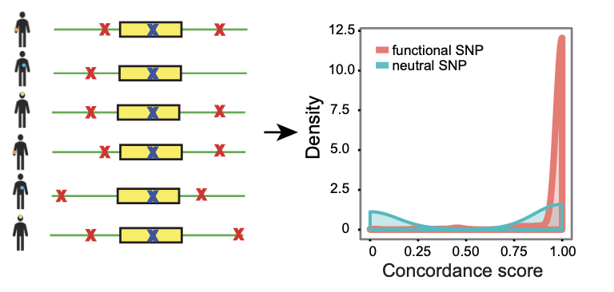

# cGMAS

cGMAS (Concordance-based GMAS) is a method for predicting functional SNPs for GMAS (genetically-modulated alternative splicing) events. GMAS events have associated SNPs that can serve as tag SNPs. If a SNP is functional for GMAS, we expect to see a concordant SNP genotype and alternative splicing pattern accross a large number of individuals. We can quanitify the concordance between genotype and splicing pattern using a concordance score (Si). This method cannot distinguish true functional and neutal SNPs if they are in perfect LD. Also, the method requires a large number of individuals.



## Table of contents
[A. Preprocessing](#a-preprocessing)
- Identify GMAS events (GMAS SNPs and GMAS exons)
- Determine genotype of candidate functional SNPs

[B. Calculating concordance score (Si)](#b-calculating-concordance-score-si)

[C. Filtering for candidate functional SNPs for GMAS](#c-filtering-for-candidate-functional-snps-for-gmas)
- Identify Si score peak
- Filter by mean Si scores and Si peak magnitude
- FDR corrections

[D. Credits](#d-credits)


## A. Preprocessing
We can use the [ASARP pipeline](https://legacy.ibp.ucla.edu/research/xiao/Software_files/ASARP/doc/) to get high-quality tag SNPs and GMAS events as input for this pipeline.

### Get geontypes per tissue
Get the genotype of candidate SNPs. Possible sources: genotype information and RNA-seq data.
```
usage: gt.per.tissue.py [-h] -i infdir -a asasf -r refdir -t total -m mono -u
                        upperAR -l lowerAR -o outf

Get genotypes per tissue

optional arguments:
  -h, --help  show this help message and exit
  -i infdir   Input SNV count files dir
  -a asasf    Input asas file,asas events that are in at least X samples, sep by comma
  -r refdir   ref GT files directory
  -t total    total coverage to tell homozygous dbSNPs
  -m mono     mono coverage to tell homozygous dbSNPs
  -u upperAR  upper-bound allelic ratio for heterozygous dbSNPs (<=)
  -l lowerAR  lower-bound allelic ratio for heterozygous dbSNPs (>=)
  -o outf     Output file
```


## B. Calculating concordance score (Si)
### 1. Get candidate functional SNPs

Union of GMAS events from all samples in a study. It does NOT matter which individuals we identified the GMAS events from.
 ```
usage: candid.bed.py [-h] -i ind -d indir -s suff -m min -o outf

Get candidate functional SNPs

optional arguments:
  -h, --help  show this help message and exit
  -i ind      Individual of interest
  -d indir    Input file directory
  -s suff     file suffix
  -m min      min number of tissues to decide heterozygous
  -o outf     Output file
 ```

### 2. Get genotypes of candidate functional SNPs
Each individual should have his or her specific list of SNPs and the genotype.
```
usage: tag.bed.py [-h] -i inf -a asasf -r ref -c cov -o outf

Get candidate functional SNP genotypes

optional arguments:
  -h, --help  show this help message and exit
  -i inf      Input candidate SNP bed file
  -a asasf    Input file with GMAS events that are in at least X samples
  -r ref      alleles count ref file
  -c cov      tag snv coverage
  -o outf     Output file
```

### 3. Calculate concordance scores
```
usage: splicing.concordance.py [-h] -i inf -d indiv -t tag -m maxD -o outf -a
                               anno -s search

Calculate concordance scores

optional arguments:
  -h, --help  show this help message and exit
  -i inf      Input candidate functional SNP bed file
  -d indiv    Input individual ID
  -t tag      tag snp bed file
  -m maxD     max d for RNA-seq defined tag snvs
  -o outf     Output file
  -a anno     gene annotation bed file
  -s search   max dist in nt from candidate functional snp to the AS exon to be
              tested; input "INF" to test all possible snp pairs within the same
              gene
```

## C. Filtering for candidate functional SNPs for GMAS
### 1. Model Si scores of an event using GMM to get the Si score peak locations and to remove cases with shallow Si score peak magnitude.
```
usage: peak.si.rm.bg.py [-h] -i inf [-r ref] [-m min] -n N -o outf -b bin -p
                        het

Remove cases with shallow Si score peak magnitude

optional arguments:
  -h, --help  show this help message and exit
  -i inf      Input file prefix
  -r ref      SNVs to be filtered out
  -m min      min data points (individuals) in the Si distri
  -n N        Number of GMM components fitted
  -o outf     Output file
  -b bin      bin for randomization
  -p het      Percentage of heterozygous individuals
```

### 2. Get candidate functional SNPs based on Si, majorR, ... thresholds
Details on thresholds: For a given candidate SNV and target exon pair, all of its tag SNVs must pass all the filters except for the (n) filter below:
- **v1**
  - number of individuals (n): 40
  - P-value testing whether the GMM is significantly different from Si = 1 (p): 0.1
  - Min Si (s): 0.8
  - Min % individuals in major GMM (m): 0.9 -> applies to only tag SNVs that have high enough (n)
  - Take out cases with all individuals who are homozygous (-M yes)
 
```
usage: get.causal.v1.py [-h] -i annoI -e annoE -r causalf -o outf -t tissue -s
                        si -p pval -n minPt -m major

Get functional SNPs - v1

optional arguments:
  -h, --help  show this help message and exit
  -i annoI    intron anno bed
  -e annoE    exon anno bed
  -r causalf  ref causal si file dir
  -o outf     Output file
  -t tissue   tissue of interest
  -s si       min Si
  -p pval     min pval; pval is testing whether si is diff from 1
  -n minPt    min data points (indiv) per causal-exon-tag pair
  -m major    min membership ratio of the major component
```

- **v2**
  - number of individuals (n): 40
  - P-value testing whether the GMM is significantly different from Si = 1; Si = 0 (p): 0.1,0.01 -> >= 0.1 for Si = 1 and <= 0.01 for Si = 0
 
 ```
 usage: get.causal.v2.py [-h] -i annoI -e annoE -r causalf -o outf -t tissue -p
                        pval -n minPt

Get functional SNPs - v2

optional arguments:
  -h, --help  show this help message and exit
  -i annoI    intron anno bed
  -e annoE    exon anno bed
  -r causalf  ref causal si file dir
  -o outf     Output file
  -t tissue   tissue of interest
  -p pval     min pval; pval is testing whether si is diff from 1
  -n minPt    min data points (indiv) per causal-exon-tag pair
 ```
 
- **v2b**
  - number of individuals (n): 40
  - P-value testing whether the GMM is significantly different from Si = 1; Si = 0 (p): 0.05,0.05 -> <= 0.05 for Si = 1 and <= 0.05 for Si = 0
  - Min % individuals in major GMM (m): 0.9 -> applies to only tag SNVs that have high enough (n)
  - Min % het individuals (s; gtr): 0.95
 
 ```
 usage: get.causal.v2b.py [-h] -i annoI -e annoE -r causalf -o outf -t tissue
                         -s gtr -p pval -n minPt -m major

Get functional SNPs - v2b

optional arguments:
  -h, --help  show this help message and exit
  -i annoI    intron anno bed
  -e annoE    exon anno bed
  -r causalf  ref causal si file dir
  -o outf     Output file
  -t tissue   tissue of interest
  -s gtr      min GT ratio: RV/totalIndiv
  -p pval     min pval; pval is testing whether si is diff from 1
  -n minPt    min data points (indiv) per causal-exon-tag pair
  -m major    min membership ratio of the major component
 ```
 
### 3. Filter out non-functional SNPs
- **v1**
 ```
 usage: detect.non-causal.py [-h] -i inf [-r ref] -s suff -o outf

Detect non-functional SNPs - v1

optional arguments:
  -h, --help  show this help message and exit
  -i inf      Input file prefix
  -r ref      ref file with SNV tested
  -s suff     suff
  -o outf     Output file
 ```
 
- **v2**
 ```
 usage: detect.non-causal.v2.py [-h] -i inf [-r ref] -s suff -o outf

Detect non-functional SNPs - v2

optional arguments:
  -h, --help  show this help message and exit
  -i inf      Input file prefix
  -r ref      ref file with SNV tested
  -s suff     suffix
  -o outf     Output file
 ```
 
- **v2b**
 ```
 usage: detect.non-causal.v2b.py [-h] -i inf [-r ref] -s suff -o outf

Detect non-functional SNPs - v2b

optional arguments:
  -h, --help  show this help message and exit
  -i inf      Input file prefix
  -r ref      ref file with SNV tested
  -s suff     suffix
  -o outf     Output file
 ```
 
### 4. FDR corrections
- v1 : fisherP.adjust.R (fisherP.adjust.sh)
- v2 : p.adjust.R (p0.adjust.sh)
- v2b: p.adjust.R (p0.adjust.v2b.sh)

## D. Credits
- Esther Hsiao
- [Grace Xiao lab](https://www.xiao-lab.org/)
